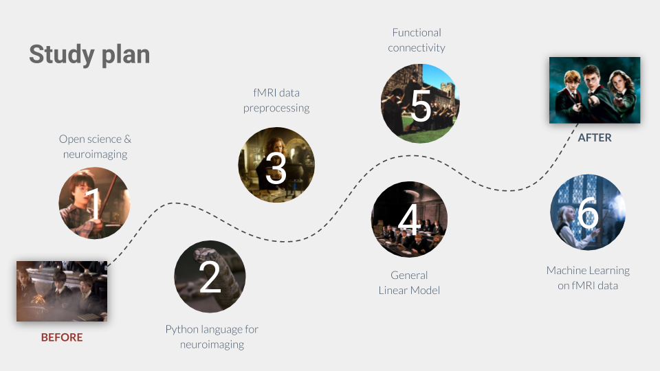

# fMRI data analysis course

Materials for *fMRI data analysis* course taught at [Nicolaus Copernicus University](https://www.umk.pl/en/) in Toruń
for cognitive science students (including first-year students). The original course was called 
*Advanced fMRI data analysis course* but it rather contains fundamental topics in fMRI 
data analysis. The "advanced" part refers to using Python and scripts (not GUI's) 
over entire classes.

### The Hogwarts way 
I called the way of teaching the course *the Hogwarts way*. It refers to the fact 
that for most participants, the fMRI data analysis, python programming, version control, etc. was like magic at the beginning of the course.
The goal of the course was to introduce topics of fMRI data analysis, reproducibility, 
Python, and version control, giving students a lot of **FUN**  and freedom. 
 

The most important goal of the course was to reduce the initial fear of trying something 
entirely new, which is, in fact, quite complex. 

:warning: **Content warning**:
The course includes a lot of *Harry Potter* content not suitable for muggles 
and too serious people.

### How to become *neuroinfomagician*?

## General information

The course was supported by [DataCamp Classroom](datacamp.com/groups/education) and 
[GitHub Education](https://education.github.com/). 

#### Time
- **Lectures and practice**: 30h (split into 3h sessions, every two weeks)
- **Homework, DataCamp Python courses, poster preparation**: ~50h (self work)
- **Total time required to finish the course**: ~80h

#### Grading 
Activity + Homework + Poster + Magic

## Content

### I. Introduction to neuroimaging & open science (3h)

##### Tools:
Jupyter lab, Markdown

##### Homework:
- GitHub Classroom: fMRI Q&A in Markdown
- DataCamp: Introduction to Python
- DataCamp: Intermediate Python

### II. fMRI data manipulation in Python (3h)

##### Tools: 
Matplotlib, Numpy, Nibabel, Nilearn, Pandas

##### Practice:
- Structural MRI manipulation
- Functional MRI manipulation
- Dataframes manipulation in Pandas

##### Homework:
- GitHub Classroom: fMRI data manipulation in Python
- DataCamp: Data Manipulation with pandas
- DataCamp: Merging DataFrames with pandas
- DataCamp: Introduction to Data Visualization with Matplotlib

### III. fMRI data preprocessing (3h)
##### Tools: 
Nipype, Porcupine, fMRIPrep

##### Practice:
- Linear transformations in Python
- Preprocessing with Nipype

##### Homework:
- YouTube: 3Blue1Brown Linear Algebra videos
- DataCamp: Exploratory Data Analysis in Python

### IV. General Linear Model (3h + 3h)

##### Tools: 
Nistats, Nilearn, Sklearn

##### Practice: 
- Simple linear regression
- Multiple linear regression
- GLM on fMRI data

##### Homework:
- GitHub Classroom: Linear & multiple linear regression
- GitHub Classroom: GLM analysis & fMRI results plotting
- DataCamp: Introduction to Linear Modeling in Python
- DataCamp: Statistical Thinking in Python (Part 1)

### V. Functional connectivity & machine learning on fMRI data (3h) 
##### Tools: 
Nilearn, Scipy

##### Practice:
- Brain parcellations
- Seed-seed connectivity
- Seed-voxel connectivity
- ML on fMRI data 

##### Homework: 
- GitHub Classroom: seed-based functional connectivity
- Poster assignment 